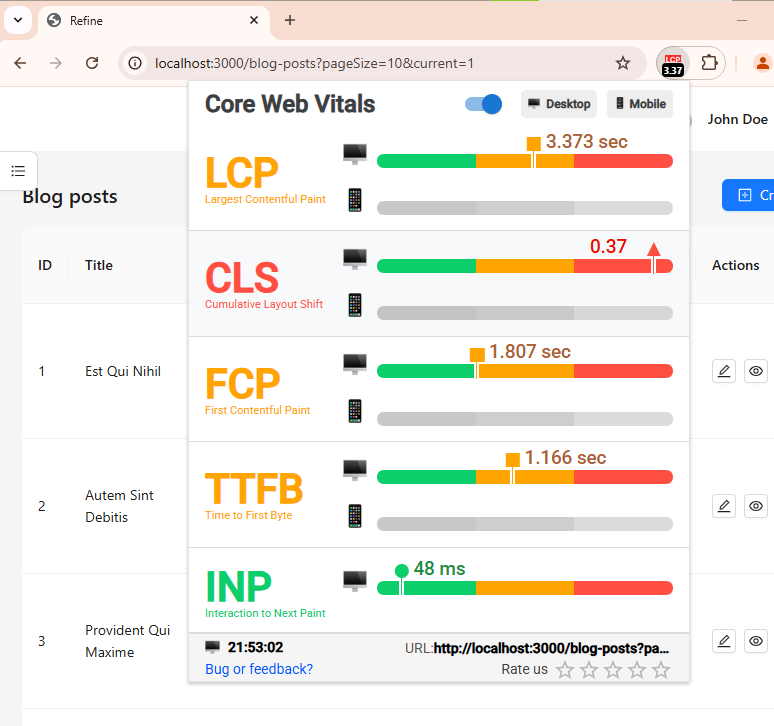
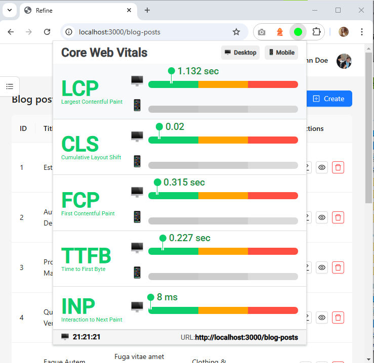

# 🧩 Customizing a Refine + Next.js Project with Ant Design (antd)

## 🔍 Introduction

This project demonstrates how to optimize and customize a **Refine + Next.js** application using **Ant Design (antd)** as the UI framework. The primary goals were to:

- Improve performance through advanced Next.js configurations  
- Enable modular and lazy imports for smaller bundles  
- Enhance user experience with faster load times and responsive UIs  
- Observe measurable improvements in Core Web Vitals after build  


## 🎥 Quick Demo

Watch the video below to see the performance improvements in action — faster page loads, smoother interactions, and enhanced responsiveness after the optimizations!


## What is Refine?

**Refine** is a React-based headless framework designed for building CRUD-heavy internal tools, dashboards, and admin panels. It provides out-of-the-box integrations with popular libraries for data fetching, authentication, UI, and routing.

## What is Ant Design (antd)?

**Ant Design** is an enterprise-class React UI library offering a large set of high-quality, reusable components. It is well-suited for building consistent and elegant UIs, and integrates seamlessly with Refine.

## ⚙️ Step 1: Customizing `next.config.mjs`

Here’s the final version of our `next.config.mjs` file, configured better performance, modular imports, and a smaller build size:

```js
/** @type {import('next').NextConfig} */
const nextConfig = {
  transpilePackages: [

    "@refinedev/core",
    "@refinedev/devtools",
    "@refinedev/nextjs-router",
    "@refinedev/kbar",
    "@refinedev/nestjsx-crud",
    "@refinedev/antd",
    "@ant-design/icons",
    "antd",
  ],
  experimental:{
    optimizePackageImports :  [

      "@refinedev/core",
      "@refinedev/devtools",
      "@refinedev/nextjs-router",
      "@refinedev/kbar",
      "@refinedev/nestjsx-crud",
      "@refinedev/antd",
      "@ant-design/icons",
      "antd",
    ]
  },
  swcMinify: true,
  modularizeImports: {
    antd: {
      transform: "antd/es/{{member}}",
      preventFullImport: true,
    },
    "@ant-design/icons": {
      transform: "@ant-design/icons/es/icons/{{member}}",
      preventFullImport: true,
    },
  },
  compiler: {
    reactRemoveProperties: true,
    removeConsole: {
      exclude: ["error", "warn"], 
    },
  },
  
  output: "standalone",

};

export default nextConfig;


```

### 🧩 Explanation of Each Section

#### 📦 `transpilePackages`
```javascript
transpilePackages: [
  "@refinedev/core",
  "@refinedev/devtools",
  "@refinedev/nextjs-router",
  "@refinedev/kbar",
  "@refinedev/nestjsx-crud",
  "@refinedev/antd",
  "@ant-design/icons",
  "antd",
]
```
- Ensures these external packages are transpiled for better compatibility with the Next.js build system.
- Prevents issues that might occur with libraries that ship modern JavaScript.

---

#### 🚀 `experimental.optimizePackageImports`
```javascript
experimental: {
  optimizePackageImports: [
    ...
  ]
}
```
- Enables experimental optimization to import only the parts of libraries you actually use.
- Significantly reduces bundle size, especially for large libraries like Ant Design.

---

#### ⚡ `swcMinify`
```javascript
swcMinify: true
```
- Uses **SWC** (a Rust-based compiler) to minify JavaScript efficiently.
- Makes production builds smaller and faster.

---

#### 🧩 `modularizeImports`
```javascript
modularizeImports: {
  antd: {
    transform: "antd/es/{{member}}",
    preventFullImport: true,
  },
  "@ant-design/icons": {
    transform: "@ant-design/icons/es/icons/{{member}}",
    preventFullImport: true,
  },
}
```
- Optimizes imports to avoid loading the entire **antd** or **icons** library.
- Imports only the specific components you use (`Button`, `Table`, etc.).
- `preventFullImport: true` ensures you can't accidentally import everything at once.

---

#### 🔒 `compiler`
```javascript
compiler: {
  reactRemoveProperties: true,
  removeConsole: {
    exclude: ["error", "warn"],
  },
}
```
- `reactRemoveProperties: true`: Strips out React props like `data-testid` during production builds.
- `removeConsole`: Removes all `console.log` statements except `console.error` and `console.warn` to keep production code clean and secure.

---

#### 🛠️ `output`
```javascript
output: "standalone"
```
- Configures Next.js to build a **standalone** production bundle.
- Ideal for Docker deployments, serverless platforms, and minimal server environments.


✅ **Result**:  
With these optimizations, the application achieves **faster page loads**, **smaller JavaScript bundles**, and **improved Core Web Vitals**, providing a much better user experience.


## 🚀 Step 2: Adding a `loading.tsx` Component

In order to improve perceived performance and create a smoother user experience, we introduced a global loading fallback component:

```tsx
// app/loading.tsx
const Loading = () => (
  <div className="flex items-center justify-center h-screen text-lg">
    Loading...
  </div>
);

export default Loading;
```

### 🧠 Why Adding a `loading.tsx` Helps Performance

- **Instant Visual Feedback**  
  Instead of leaving users staring at a blank screen while content loads, a loading component provides immediate feedback. Users perceive the app as faster because they can see that something is happening right away.

- **Improves "Perceived Performance"**  
  Even if the actual load time stays the same, users feel the app is more responsive when they see a loading indicator instantly.  
  → In UX design, **perceived performance** is just as important as actual speed.

- **Optimized with Server Components and Lazy Loading**  
  In Next.js 13+ (especially with the App Router), when you lazy-load components or server-render parts of the UI, Next.js automatically shows your `loading.tsx` during the load.  
  This reduces **Largest Contentful Paint (LCP)** time, which is a critical Core Web Vitals metric for page performance.

- **Avoids "White Screens" and Sudden Layout Shifts**  
  Without a `loading.tsx`, users might see a blank page before content appears, leading to frustration or the impression that the app is broken.  
  With a loader, you also prevent sudden content shifts that can hurt your **Cumulative Layout Shift (CLS)** score.

- **Better for SEO and Accessibility**  
  Even though bots (like Googlebot) index the final content, having proper visual fallbacks improves the page rendering lifecycle, helping SEO indirectly.


✅ **Result**:  
With a global `loading.tsx`, the application feels faster, smoother, and more polished — directly improving user satisfaction and Core Web Vitals scores.

## ⚡ Step 3: Dynamic Imports with `next/dynamic`

To optimize our application properly for Next.js, we replaced `React.lazy()` with **Next.js dynamic imports** using `next/dynamic`:

```tsx
import dynamic from "next/dynamic";
import { Suspense } from "react";
import LoadingSpinner from "@context/loadingSpinner";

const BlogPostCreateComponent = dynamic(
  () => import("@components/blog/create"),
  {
    ssr: false,
    loading: () => <LoadingSpinner />,
  }
);

export default function BlogPostCreate() {
  return (
    <Suspense fallback={<LoadingSpinner />}>
      <BlogPostCreateComponent />
    </Suspense>
  );
}
```

### 🧠 Why Use `dynamic()` Instead of `React.lazy()` in Next.js

- **Built-in for Next.js Optimization**  
  `dynamic()` is the recommended method in Next.js for lazy-loading components. It integrates better with Next.js routing, server/client distinction, and bundling strategies.

- **Control Over Server-Side Rendering (SSR)**  
  By setting `ssr: false`, we ensure that browser-only components (like editors, modals, or components accessing `window`) are rendered only on the client side, preventing potential SSR crashes.

- **Custom Loading State**  
  Instead of showing a generic "Loading..." text, we show a custom `<LoadingSpinner />` component while the dynamic module is being loaded, improving user experience.

- **Automatic Code Splitting**  
  `dynamic()` automatically splits the component into a separate JavaScript chunk, reducing the size of the initial page bundle.

- **Suspense Friendly**  
  Even though `dynamic()` provides a `loading` option, we still wrap the dynamic component in a `Suspense` boundary to ensure compatibility with future React Server Component features.


✅ **Result**:  
By using `next/dynamic`, the app loads faster, stays stable during SSR, and feels much more responsive to users.


👉 **Summary**:  
✅ Use `next/dynamic` with `ssr: false` for browser-only components.  
✅ Always show a custom loading spinner or skeleton screen for a better user experience.  
✅ Avoid using `React.lazy()` directly in Next.js projects unless inside purely client components.


## 🎨 Step 4: Tailwind CSS Optimization with JIT Mode

To further optimize styling performance and reduce unused CSS, enable **Just-in-Time (JIT) mode** in your `tailwind.config.js` file. This ensures that Tailwind generates only the styles actually used in your project.

### ✅ Updated `tailwind.config.js`

```js
/** @type {import('tailwindcss').Config} */
export default {
  mode: 'jit',

  content: [
    './src/**/*.{js,ts,jsx,tsx,mdx}',
  ],
  theme: {
    extend: {},
  },
  plugins: [],
};
```

### 🧠 Why JIT?

- ⚡ **Faster builds** in development
- 📉 **Smaller CSS bundles** in production
- 🎯 **Utility classes available on demand** without manually defining them in advance

> 📌 Tailwind's JIT engine is the recommended approach for all new projects to ensure maximum performance and responsiveness.


## 📦 Running the Project

To get the project up and running, follow these steps:

```bash
# Install dependencies (make sure you have pnpm installed)
pnpm install

# Start development server
pnpm dev

# Create a production build
pnpm build

# Start the production server
pnpm start
```

> 🧠 **Note:** The true performance improvements from optimizations  become clearly visible **after running `pnpm build` and launching with `pnpm start`**. This is when Next.js applies full production-level optimizations.


## 📈 Performance Comparison: Before vs. After

### Before Optimization
- Full library imports
- Bloated console and debug code in production
- No lazy loading
- Slower rendering and initial load

### After Optimization
- 📦 Tree-shaken, modular imports
- 💤 Lazy-loaded components for non-blocking UI
- 🧹 Clean builds without test or debug props
- 🚀 Faster builds, deploys, and runtime performance


## 📊 Core Web Vitals: Before and After Optimization

### What Are Core Web Vitals?

| Metric | Description | Good Score |
|--------|-------------|------------|
| LCP    | Time to load the largest visible element | ≤ 2.5s |
| FCP    | Time until first content appears | ≤ 1.8s |
| CLS    | Visual stability during layout shifts | ≤ 0.1 |
| TTFB   | Server response time | ≤ 600ms |
| INP    | Time between interaction and response | ≤ 200ms |

---

### 🐢 Before Optimization




### ⚡ After Optimization



> ✅ These improvements are most apparent in production, especially after running `pnpm build` and deploying your app.


## ✅ Conclusion

Through custom configuration of `next.config.mjs`, implementation of `loading.tsx`, and use of lazy loading via `Suspense`, we successfully improved both developer experience and app performance.

This setup ensures:
- ✅ Modern development experience
- 🚀 Optimized builds
- 🧩 Scalable and modular structure
- 📊 Excellent Core Web Vitals for better SEO and UX


